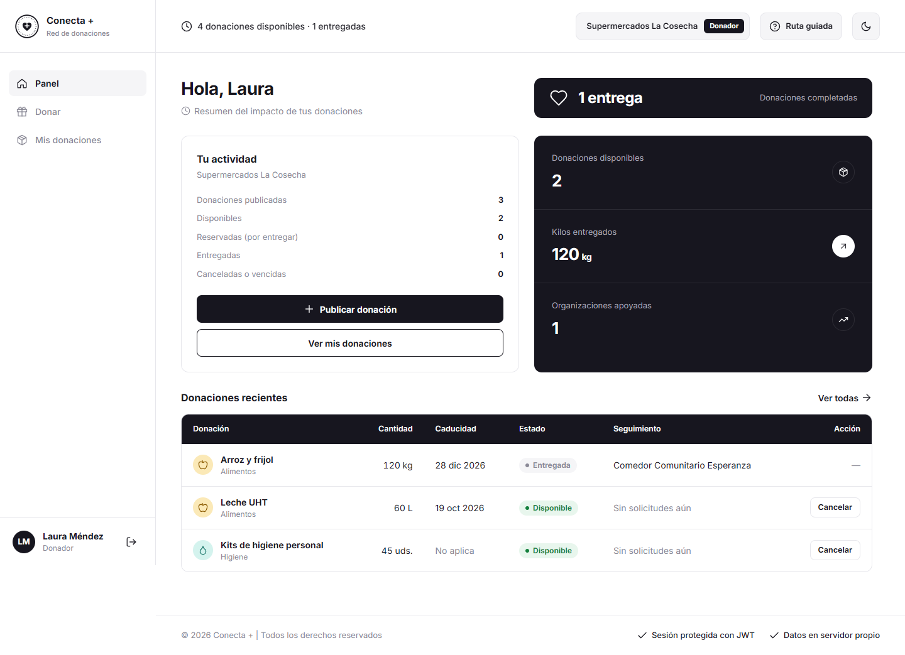
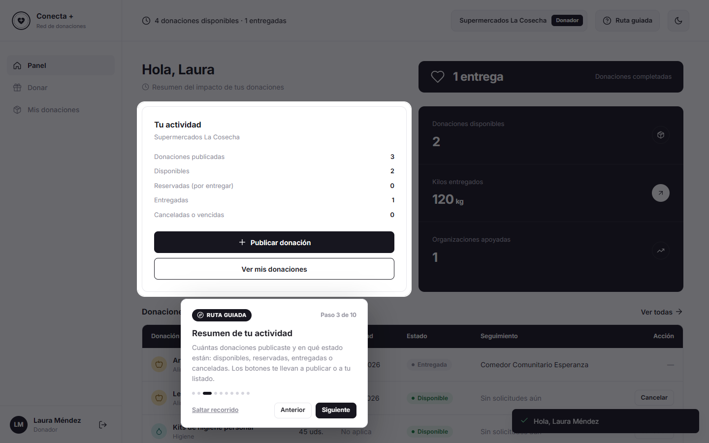
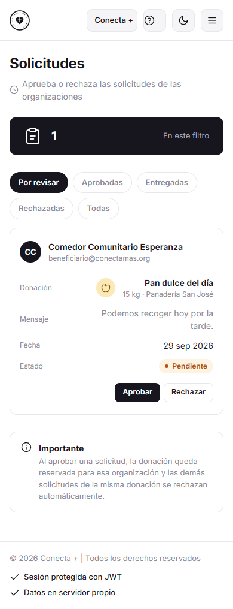

# Conecta + · Plataforma de gestión de donaciones

> **Proyecto final de la materia Ingeniería de Software**
> Alumno: Evan David Morales Serrano · Matrícula: AL03086130 · Profesor: Santos Guadalupe Facio Barraza

Sistema web para gestionar donaciones de alimentos y recursos entre **empresas o personas donadoras** y **organizaciones sociales beneficiarias**, con un **equipo administrador** que verifica organizaciones y asigna las donaciones.

- **Backend:** Node.js 20 + Express, autenticación **JWT** con roles.
- **Almacenamiento:** en el propio servidor (memoria + archivo JSON con escritura atómica). **No usa base de datos ni servicios externos de pago.**
- **Frontend:** HTML/CSS/JS sin frameworks, responsive (escritorio y móvil), modo claro/oscuro.
- **Calidad:** Jest (131 pruebas, cobertura ≈ 99 %), ESLint, SonarQube, OWASP ZAP.
- **CI/CD:** GitHub Actions con despliegue automático en un entorno de prueba (staging) basado en Docker.

## Roles

| Rol | Qué puede hacer |
|---|---|
| **Donador** | Publicar donaciones (con caducidad obligatoria para alimentos), ver su estado, cancelar las disponibles, ver su impacto (kg entregados, organizaciones apoyadas). |
| **Beneficiario** | Registrarse como organización (queda *pendiente* hasta ser verificada), explorar/buscar donaciones disponibles, solicitarlas, cancelar solicitudes pendientes y confirmar la recepción. |
| **Administrador** | Verificar, suspender o reactivar cuentas; aprobar, rechazar o revocar solicitudes; registrar entregas; cancelar donaciones; ver métricas globales y el registro de auditoría. No se puede crear desde el registro público. |

### Ruta guiada

Cada rol tiene una **ruta guiada** que recorre sus paneles, resalta cada elemento y explica para qué sirve. Arranca sola la primera vez que el usuario entra y se puede repetir con el botón **Ruta guiada** de la barra superior. Funciona en escritorio y móvil y se maneja con el teclado (← → para avanzar o retroceder, Esc para salir).

| Rol | Paneles que recorre |
|---|---|
| Donador (10 pasos) | Panel (impacto, actividad, métricas) → Donar (formulario y ciclo de la donación) → Mis donaciones (filtros y seguimiento) |
| Beneficiario (10 pasos) | Panel (lo recibido, solicitudes, métricas, por recoger) → Donaciones disponibles (búsqueda y solicitud) → Mis solicitudes (filtros, cancelar y confirmar recepción) |
| Administrador (11 pasos) | Panel (pendientes, usuarios, métricas, gráficas) → Solicitudes → Donaciones → Usuarios → Auditoría |

### Flujo de una donación

```
Donador publica ──► DISPONIBLE ──► Organización solicita (PENDIENTE)
                                          │
                     Admin aprueba ◄──────┘  (las demás solicitudes se rechazan)
                          │
                      RESERVADA ──► Organización confirma recepción ──► ENTREGADA
   (si la fecha de caducidad pasa sin asignarse ──► VENCIDA)
```

## Ejecutar en local

```bash
npm install
npm start            # http://localhost:3000
```

`npm start` carga la configuración de demostración de [`demo.env`](demo.env) (las credenciales no están en el código) y crea datos de prueba:

| Cuenta | Correo | Contraseña |
|---|---|---|
| Administrador | `admin@conectamas.org` | `Admin12345` |
| Donador | `donador@conectamas.org` | `Demo12345` |
| Beneficiario (verificado) | `beneficiario@conectamas.org` | `Demo12345` |
| Beneficiario (sin verificar) | `albergue@conectamas.org` | `Demo12345` |

Los datos se guardan en `data/db.json` (se crea automáticamente, está en `.gitignore`). Variables de entorno en [`.env.example`](.env.example). En producción (`NODE_ENV=production`) son obligatorias `JWT_SECRET` (≥ 32 caracteres) y `ADMIN_PASSWORD`, y la demo se desactiva.

### Con Docker

```bash
docker build -t conecta .
docker run -p 3000:3000 -e NODE_ENV=production -e JWT_SECRET=<secreto-largo> \
  -e ADMIN_PASSWORD=<contraseña> -v conecta-data:/app/data conecta
```

## Scripts

| Comando | Descripción |
|---|---|
| `npm test` | Pruebas Jest con cobertura (umbral mínimo 80 % en líneas, ramas, funciones y sentencias). |
| `npm run lint` | ESLint. |
| `npm run smoke` | Prueba de humo contra un entorno desplegado (`BASE_URL`). |
| `bash scripts/sonar-scan.sh` | Levanta SonarQube Community en Docker, analiza y genera `reports/sonarqube/`. |
| `bash scripts/zap-scan.sh` | OWASP ZAP baseline + escaneo activo autenticado de la API, genera `reports/zap/`. |

## Pipeline CI/CD (`.github/workflows/ci-cd.yml`)

1. **Pruebas:** lint, Jest con umbral de cobertura, `npm audit`.
2. **SonarQube:** SonarQube Community en contenedor efímero; métricas publicadas en el resumen y como artefacto.
3. **Build:** imagen Docker (multi-stage, usuario sin privilegios, healthcheck).
4. **Despliegue en staging:** se ejecuta el contenedor con secretos generados en el momento, prueba de humo de 17 verificaciones y **OWASP ZAP** (falla si hay alertas de riesgo Alto).
5. **Publicación:** en `main`, la imagen se sube a GitHub Container Registry (`ghcr.io`).

## Seguridad

Resumen de controles (detalle en [`docs/SEGURIDAD.md`](docs/SEGURIDAD.md)):

- JWT HS256 con emisor/audiencia, algoritmo fijado (rechaza `alg=none`), expiración de 2 h y **revocación en servidor** (logout y suspensión invalidan tokens).
- Cookie `httpOnly` + `SameSite=Strict` + verificación de `Origin` (CSRF); el token no es accesible desde JavaScript.
- Contraseñas con bcrypt, política de complejidad, bloqueo tras 5 intentos fallidos, mensajes genéricos y tiempo constante ante correos inexistentes.
- Validación estricta con zod (rechaza campos desconocidos → sin asignación masiva ni escalada de rol), límite de 10 KB por petición, rate limiting.
- Control de acceso por rol y por propietario (IDOR → 404), respuestas sin datos sensibles.
- Frontend sin `innerHTML` con datos de usuario + CSP estricta sin `unsafe-inline` (XSS).
- Cabeceras Helmet, `Cache-Control: no-store` en la API, errores sin trazas internas, auditoría de acciones.

## Estructura

```
src/            API (config, middleware, rutas, servicios, almacenamiento)
public/         Frontend (index.html, css, js/views por rol)
tests/          Pruebas Jest + Supertest
scripts/        Smoke test, SonarQube, OWASP ZAP y generadores de reportes
docs/           OpenAPI, seguridad e informe de cierre
reports/        Reportes generados: pruebas, SonarQube y OWASP ZAP
.github/        Pipeline CI/CD
```

## Capturas

| Donador | Ruta guiada | Administrador (móvil) |
|---|---|---|
|  |  |  |

## Documentación

- [Seguridad: controles, OWASP ZAP y SonarQube](docs/SEGURIDAD.md)
- [Especificación OpenAPI](docs/openapi.yaml)
- [Informe de cierre (Word)](docs/Informe_de_Cierre_Conecta_Mas.docx)
- [Presentación (HTML, se abre en el navegador)](docs/Presentacion_Conecta_Mas.html) · [PDF](docs/Presentacion_Conecta_Mas.pdf)
- [Reportes generados](reports/README.md)
